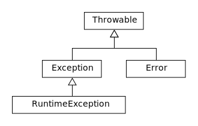

# Les exceptions

## Introduction

Les exceptions sont des anomalies susceptibles de se produire dans un programme Java, écartant celui—ci du comportement normal ou
souhaité. On dit alors qu'une exception est levée.

Les origines des exceptions sont diverses : manque de mémoire, division par zéro, tentative d’ouverture d’un fichier inexistant, etc.
Le comportement à adopter sera différent suivant la nature des exceptions.

Le compilateur Java impose la gestion des exceptions lorsque vous tentez d’utiliscr des méthodes prévoyants des exceptions. Par exemple, la
méthode `readShort` de la classe `DataInputStream` qui lit depuis un fichier peut éventuellement lever des exceptions `IOException`; elle est
donc définie avec un modificateur spécial `throws` qui signale ces erreurs potentielles.

Exemple :

```java
File f = new Fi1e(name); v

Filelnputstream fis = new FileInputStream(f);

BufferedInputstream bis = new BufferedInputStream(fis,(int)f.length());
Datalnputstream dis = new DataInputStream(bis);

short magicNumber = dis.readShort();

```

La méthode `readshort` est définie comme suit :
```java
public final short readShort() throws IOException
```


En Java on est obligé de traiter les exceptions dans le code, sinon il ne peut être compilé et le message suivant est affiché :

Exception java.lang.InterruptedException
must be caught or it must be declared in the throws clause of this method.

La méthode `readShort` levant une exception, le code de l'exemple précédent ne passe pas à la compilation.

## Gestion des exceptions

Lorsqu’une exception est levée, le déroulement du code est interrompu et le traitement des exceptions consiste alors à rechercher quelles
dispositions prendre. Au niveau de la programmation, il est possible de prévoir deux modes de codage :

1. Soit la méthode dont le code a été interrompu dispose des informations suffisantes pour corriger certaines anomalies observées (ou bien
pour émettre des messages d’erreur explicites). Dans ce cas, la méthode décide de traiter elle-même certaines exceptions dans des *blocs `catch`* associés à un *bloc `try`*.

2. Soit la méthode concernée ne dispose pas elle-même des informations suffisantes pour traiter certains types d’exceptions, mais les
méthodes appelantes peuvent disposer de ces informations. Dans ce cas les exceptions sont déclarées dans la *clause `throws`* de la
signature de la méthode afin que les méthodes appelantes soient informées des types d’exccptions susceptibles d’être levées par une
méthode.


### Traitement dans la méthode où l’exception se produit

Reprenons l'exemple précédent :

```java
public void lireImageRGB(String filename ) {

  File f = new File(name);

  Filelnputstream fis = new FileInputStream(f);

  BufferedInputstream bis = new BufferedInputStream(fis,(int)f.length());
  DataInputstream dis = new DataInputStream(bis);

  short magicNumber = dis.readShort();
  //...
}
```

La première étape consiste à inclure le code susceptible de lever des exceptions dans un *bloc `try { ... }`*
A un *bloc `try`* doivent être associées une ou plusieurs *clauses `catch`* et éventuellement un *bloc `finally`*.

```java
public void lireImageRGB(String filename ) {

    try {
      File f = new File(filename);
      FileInputStream fis = new FileInputStream(f);
      BufferedInputStream bis = new BufferedInputStream(fis,(int)f.length());
      DataInputStream dis = new DataInputStream(bis);

      short magicNumber = dis.readShort();
    }
    catch ( Exception e ) {
      System.out.println(" exception: " + e.getMessage());
      e.printStackTrace();
    }
}

```
ou plus finement :

```java
import java.io.BufferedInputStream;
import java.io.DataInputStream;
import java.io.File;
import java.io.FileInputStream;
import java.io.FileNotFoundException;
import java.io.IOException;

public class GestionExceptionProgramme {
	public void lireImageRGB(String filename ) {
		try {

			File f = new File(name);
			FileInputStream fis = new FileInputStream(f);
			BufferedInputStream bis = new BufferedInputStream(fis,(int)f.length());
			DataInputStream dis = new DataInputStream(bis);

			short magicNumber = dis.readShort () ;

		}

		catch ( NullPointerException n ) { // sous—classe de RuntimeException
			System.out.println("exception: " + n.getMessage());
			n.printStackTrace();

		}
		catch ( FileNotFoundException f ) { // sous—classe de IOException

			System.out.println(“exception: “ + f.getMessage());
			f.printStackTrace();

		}
		catch ( IOException e ) { // sous—classe de Exception

			System.out.println("exception: " + e.getMessage());
			e.printStackTrace();

		}
		finally { //Exécuté quoiqu'il arrive

			f.close(); //Ferme proprement le fichier
		}
	}
}

```

Le *bloc `try`* commence avant la ligne `File f = new File(name);` car le constructeur de la classe `File` peut lui aussi lever une exception de type
`NullPointerException`, dans le cas où le nom de fichier passé en paramètre est égal à `null`.

Si une exception se produit dans un *bloc `try`*, l'exécution de code est interrompue et les *clauses `catch`* qui lui sont associées sont examinées
dans l’ordre pour chercher si l’unc d’elles a prévu un traitement de l'exception produite. Les *clauses `catch`* sont comme des méthodes recevant un seul argument.

Si une *clause `catch`* correspond à l’exception, elle prend le contrôle de l'exécution.

Le code d’un bloc associé à une *clause `finally`* est exécuté dans tous les cas, soit après une exécution normale du *bloc `try`* soit après traitement d'une exception


### Traitement dans la méthode appelante

Pour indiquer que l'Exception n’est pas gérée dans la méthode `lireImageRGB()` et que par conséquent, elle le sera dans la méthode appelante, on utilise la *clause `throws`*.

Reprenons l'exemple précédent :

```java
public void lireImageRGB(String filename ) throws Exception {

  File f = new File(filename);

  FileInputStream fis = new FileInputStream(f);
  BufferedInputStream bis = new BufferedInputStream(fis, (int)f.length());
  DataInputStream dis = new DataInputStream(bis);

  short magicNumber = dis.readShort();

}

```

ou plus finement
```java
public void lireImageRGB(String filename ) throws NullPointerException,FileNotFoundException,IOException  {

  File f = new File(filename);

  FileInputStream fis = new FileInputStream(f);
  BufferedInputStream bis = new BufferedInputStream(fis, (int)f.length());
  DataInputStream dis = new DataInputStream(bis);

  short magicNumber = dis.readShort();

}

```

##  Nature des exceptions

Une exception est un objet (instance de classe qui hérite de la classe Throwable) qui possède des données et des méthodes membres.

Throwable a deux sous-classes : Error et Exception. Les instances d'Error sont des erreurs internes de l'environnement d'exécution Java (la machine virtuelle). Ces erreurs sont rares, et habituellement fatales; ces exceptions ne doivent pas être levées, ni capturées dans un programme. Les sous-classes d'Excepcion sont réparties entre deux catégories :

* Les exceptions d’exécution (runtime exceptions), sous-classes de la classe RunTimeException telles que:
* * ArrayIndexOutofBounds , SecurityExCeption, ou NullPointerException. Ces exceptions sont généralement liées à un défaut de
robustesse du code.

* D’autres exceptions telles que EOFExCeption et MalformedURLException qui correspondent à des évènements *anormaux*, échappant
au contrôle du programme. EOFExceptions, par exemple, se produit lorsque vous lisez dans un fichier et que celui—ci se termine
prématurément. MalformedURLException se produit lorsqu’une URL n’a pas le bon format (peut-être l'utilisateur l’a t—il mal entrée).

La hiérarchie des exceptions est comme celle des autres classes, les super-classes correspondant à des erreurs plus générales, et les sous-classes à des erreurs plus spécifiques.

La plupart des exceptions font partie du package `java.lang` (qui inclut Throwable, Exception et RuntimeException). Mais un grand
nombre d’autres packages définissent d’autres exceptions, et ces exceptions sont utilisées dans toute la bibliothèque de classes.

Par exemple,
Le package java.io définit une classe générale d’exceptions appelée IOException, qui est sous-classée non seulement dans le package
java.io pour les exceptions (d'entrée et de sortie (EOFException, FileNotFoundException), mais aussi dans les classes du package
java.net pour les exceptions de réseau telles que MalFormedURLException.




Ci dessous, est représentée une partie de la hiérarchie des exceptions.

* class java.lang.Throwable (implements java.io.Serializable)
* * class java.lang.Error
* * class java.lang.Exception
* * * class javal.langClassNotFoundExcepton
* * * class java.lang.CloneNotsupportedException
* * * class java.lang.IllegulAcccssException
* * * class java.lang.InstantiationExccption
* * * class java.lang.InterruptedException
* * * class java.Iang.NoSuchFieldException
* * * class java.lang.NoSuchMethodException
* * * class java.lang.RuntimeException
* * * class java.lang.ArithmeticException
* * * class java.lang.ArrayStoreException
* * * class java.lang.ClassCastException
* * * class java.lang.IllegalArgumentException
* * * class java.lang.NumberFormatExceplion
* * * class java.lang.IllegalMonitorStateException
* * * class java.lang.IllegalStateException
* * * class java.lang.IndexOutOfBoundsException
* * * class java.lang.ArrayIndexOutOfBoundsException
* * * class java.lang.StringIndexOutOfBoundsException
* * * class java.lang.NegativeArraySizeException
* * * class java.1ang.NullPointerException
* * * class java.lang.SecurityException
* * * class java.lang.UnsupportedOperationException
* * * class java.io.IOException
* * * class java.io.CharConversionException
* * * class java.io.FileNotFoundException
* * * class java.io.InterrupledIOException
* * * class java.io.ObjectStreamException


## Exemple

Prenons l'exemple suivant :

```java

public class ExceptionCatch {
	int moyenne(String[] liste) {
		int somme = 0, entier, nbNotes = 0;
		for (int i = 0; i < liste.length;i++) {
			try {
				entier = Integer.parseInt(liste[i]);
				somme += entier;
				nbNotes++;
			}
			catch (NumberFormatException e) {
				if ( i == 0 ) {
					System.out.println("La 1ere note n'est pas entiere");
				}
				else {
					System.out.println("La "+(i+1)+"eme note n'est pas entiere");
				}
			}
		}
		return somme/nbNotes;
	}
	public static void main(String[] argv) {
		String[] liste = {"1", "5", "toto"};

		System.out.println(
				"La moyenne est " + new ExceptionCatch().moyenne(liste));
	}
}
```

On obtient en sortie:
```
La 3eme note n'est pas entiere
La moyenne est 3
```

Si on remplace la ligne
```java
String[] liste = {"1", "5", "toto"};
```

Par
```java
String[] liste = {"toto", "15.5"};
```

On obtient:
```
La 1ere note n'est pas entiere
La 2eme note n'est pas entiere
Exception in thread "main" java.lang.ArithmeticException: / by zero
	at ExceptionCatch.moyenne(ExceptionCatch.java:20)
	at ExceptionCatch.main(ExceptionCatch.java:26)
```

Dans cet exemple deux types d’exceptions peuvent être levées :

* java. lang.NumberFormatException : lancée par la méthode parseInt: de la classe Integer si la chaine de caractères `liste[i]` ne
correspond pas à un entier. Les instructions suivantes ne sont alors pas effectuées. Ici donc, si `liste[i]` ne décrit pas un entier, les deux instructions qui suivent :

```java
  somme+=entier;
  nbNotes++;
```

ne sont pas effectuées, et on passe à l'instruction `println` intérieure au "*bloc `catch`*", puis on remonte dans la "boucle for" qui reprend son déroulement.

* java. lang.ArithmeticException : si `nbNotes` vaut 0, une exception, instance de `java.lang.ArithmeticException` est lancée.
Celle—ci n’étant pas attrapée, elle se propage alors jusqu’à la fin du programme, comme on peut le constater sur le deuxième exemple d’exécution.

Mais seule l'exception java.lang.NumberFormatException doit être obligatoirement traitée, soit localement (c’est le cas ici), soit dans la méthode appelante. En effet la méthode `parseInt` prévoyant cette exception, le compilateur oblige la gestion de l'exception dans le code.

## Création et levage de vos propres exceptions

### Création d’exception

ll est possible pour le programmeur de créer ses propres classes d'exception en héritant soit de la classe Exception (sommet de la hiérarchie des classes explicites), soit en cherchant une exception plus proche de celle que l’on veut créer. Par exemple : une exception pour un mauvais format de fichier doit normalement être une IOException.

Les classes d'exceptions ont typiquement deux constructeurs : le premier ne prend pas d'argument, et le second prend une seule chaîne comme argument. Dans le second, vous devez appeler `super()` dans le constructeur pour vous assurer que la chaine est utilisée au bon endroit dans l'exception.

Les classes d'exceptions ont le même aspect que d’autres classes. Vous pouvez les placer dans leur propres fichiers source et les compiler comme n'importe quelles autres classes.

Exemple :

```java
public class NotesNonValidesException extends Exception {

	public NotesNonValidesException(String msg) { // Ce message sera utilisé
		super(msg); // par la méthode getMessage()  
	}

	public String toString() {
		// Rappel : cette méthode permet
		// de convertir l'objet en une
		return("Aucune note n'est valide"); // chaîne de caractères
	}
}

```

### Levée d’exception
L'exception est levée dans le code à l’aide de la *clause `throw`*.

Reprenons l'exemple précédent (`ExceptionCatch`). Imaginons que nous voulions éviter, l'exception `java.lang.ArithmeticException`. Une solution consiste à tester si `nbNotes == 0`, avant d'effectuer le calcul de la moyenne et à signaler le problème en levant l'exception créée précédemment (`NotesNonValidesException`).

#### Programme

```java

public class ExceptionThrow {
	static int moyenne(String[] liste) throws NotesNonValidesException {
		int somme = 0,entier, nbNotes = 0;
		int i;
		for (i = 0;i < liste.length;i++){
			try {
				entier = Integer.parseInt(liste[i]);
				somme += entier;
				nbNotes++;
			}
			catch (NumberFormatException e) {
				if ( i == 0 ) {
					System.out.println("La 1ere note "+ "n'est pas entiere");
				}
				else {
					System.out.println("La "+(i+1)+"eme note "+ "n'est pas entiere");
				}
			}
		}
		if (nbNotes == 0) throw new NotesNonValidesException("Dommage");

		return somme/nbNotes;
	}

	public static void main(String[] argv) {
		try {
			System.out.println("La moyenne est "+moyenne(argv));
		}
		catch (NotesNonValidesException e) {
			System.out.println(e);
			System.out.println(e.getMessage());
		}
	}
}

```

Pour :
```
java ExceptionThrow ha 15.5
```

On obtient :

```
La 1ere note n'est: pas entière
La 2eme note n'est pas entiere
Aucune note n'est valide
Dommage
```

#### Explications

##### throws NotesNonvalidesException

La méthode `moyenne` indique ainsi qu’il est possible qu’une de ses instructions envoie une exception de type `NotesNonValidesException` sans que celle-ci soit attrapée par un mécanisme `try`-`catch`. Il est obligatoire d'indiquer ainsi un éventuel lancement d’exception non attrapée, sauf pour les exceptions les plus courantes de l‘API (`RuntimeException`). Si vous oubliez de signaler par la *clause `throws`* l'éventualité d’un tel lancement d'exception, le compilateur vous le rappelera.

##### throw new NotesNonvalidesException()
On demande ainsi le lancement d’une instance de `NotesNonvalidesException`. Une fois lancée, l'exception se propagera comme expliqué dans l’exemple précédent. Ici, il y aura sortie de la méthode `moyenne`, on se retrouve alors à
l’appel de la la méthode `moyenne` dans le main, appel qui se trouve dans un *bloc `try`*  suivi d’un *bloc `catch`* qui attrape les `NotesNonValidesException` : l’instruction de ce *bloc `catch`* est effectuée. Le programme reprend alors son cours normal (pour se terminer).


### Exercices
#### Saisie de nombres entiers naturels
Ecrire une classe `GestionEntiersNaturels` permettant la saisie et le stockage de nombres entiers naturels dans un tableau d'entier.

La classe contenant le programme principal (méthode `main`) sera nommée `EntiersNaturels`

Un entier naturel est un entier positif ou nul.

Le tableau d'entiers aura une taille fixée (par ex: 5).
1. L'utilisateur pourra choisir :
   1. de saisir un nouveau nombre
   1. de supprimer le dernier nombre du tableau
   1. de vider le tableau
1. Lorsque l'utilisateur saisit un nombre, le programme le fait enregistrer par la classe `GestionEntiersNaturels`. Si c'est un entier naturel, l'entier est enregistré dans le tableau. Si ce n'est pas le cas, une exception est levée (`IllegalArgumentException`)
2. Si le tableau est déjà complet, une exception est levée. Elle indique que le tableau est plein et qu'il faut le vider ou supprimer un élément.


#### Gestion des formes
Reprendre le programme `GestionForme` et y ajouter la gestion des Exceptions telle que définie ci-dessus:
1. lever une exception dans la classe `ListeForme` lorsque l'index utilisé (ajout, suppression) est incorrect (en réutilisant la classe `ArrayIndexOutOfBoundsException`)
2. lever une exception dans la classe `Forme` et ses sous-classes lorsqu'une valeur est incorrecte (longueur négative par exemple). Vous utiliserez la classe `IllegalArgumentException`
3. traiter l'exception précédente dans les classes appelantes (avec affichage d'un message d'erreur explicite)
4. lever une exception dans la classe `GestionForme` lorsqu'un choix est incorrect (type de forme, choix du menu inexistant). Pour cela, vous créerez une classe `ChoixIncorrectException`
