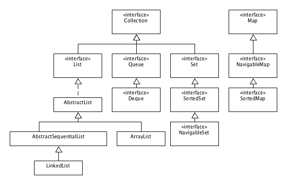

# Les collections

## Introduction

Les collections en Java permettent de gérer des **ensembles** d’objets.

Java propose par défaut une bibliothèque de classes permettant de couvrir l’essentiel des besoins d’un programmeur pour gérer des **ensembles**.

Pour commencer, nous allons nous limiter à la gestion de liste d'objets (`List`/`ArrayList`), mais nous verrons plus tard qu'il est possible d'utiliser d'autres types d'ensemble.

Nous allons également découvrir l’utilité des Generics dans l’usage des collections, ainsi que l'Autoboxing/Unboxing.

## L'interface List et la classe ArrayList

Un premier type de collection très utilisé est `List`. Il permet de traiter un ensemble d'objets sous la forme de liste.

Par définition, une liste est ordonnée. Elle est définie par sa longueur, c'est à dire le nombre d'enregistrements qu'elle contient.

Le nombre d'objets distinct peut être différent du nombre d'enregistrement. Autrement dit, elle peut contenir des doublons.

### Les méthodes principales
`java.util.List` est une interface qui propose les fonctions suivantes (non exhaustif):

* `public int size()` : détermine le nombre d'éléments dans la liste (et donc l'index maximal auquel on peut accéder)
* `public E get(int index)`  : récupère l'élément positionné à l'index donné en paramètre
* `public boolean contains(Object o)`: indique si oui ou non l'objet passé en paramètre est contenu dans la liste.
* `public int indexOf(Object o)` : indique l'index où se positionne l'objet passé en paramètre dans la liste.
* `public void add(E e)` : ajoute un élément de type `E` dans la liste
* `public E remove(int index)` : supprime un élément de type `E` dans la liste et renvoie cet élément
* `public boolean remove(Object o)` : supprime la première occurrence trouvé de l'élément passé en paramètre de la liste

L'interface `List` ne peut être instanciée.

`java.util.ArrayList` est une classe (concrète) qui implémente cette interface et qui peut être instanciée.

Vous aurez remarqué le type de retour de `get(int)`. `E` est le type d'objet contenu par la liste. Nous allons voir à quoi cela correspond dans le paragraphe suivant.

## Typage des objets et généricité
Une `List`, par essence, permet de stocker n'importe quel objet. Ce sont  donc des instances d'`Object` qui sont stockés dans une liste.

Il serait peu pratique de devoir spécifier à chaque utilisation des méthodes `get(int)`, `remove(int)` le type de l'objet retourné.

### Avant les Generics
Dans les version antérieures à la version 1.5 de Java, il était nécessaire d'écrire ceci:

```java
public class AvantLesGenerics{
  List list = new ArrayList();
  public void init(){  
    Date date = new Date(11, 12, 2013);
    list.add(date);
  }

  public void testSiPremiereDateValide(){
    Date d = (Date)list.get(0); //Transtypage indispensable
    System.out.println(d.estValide());
  }
}
```
En l'absence de transtypage, le compilateur indiquait une erreur, car la classe par défaut de `List` est `Object` et non `Date`.

Heureusement, il est possible désormais de se passer de cette étape sans intérêt : grâce aux Generics


### Avec les Generics

Juste après la déclaration du type (`List`), il est possible d'indiquer le type d'objet qu'elle contient.

Pour cela, il suffit de noter le type entre chevrons `<` et `>` : `List <Date>`. Cette déclaration indique que la liste contiendra des objets de type `Date`.

Une fois le type déclaré pour l'interface `List`, il n'est pas utile de le rappeler lors de l'instanciation.

```java
List<Date> list = new ArrayList<>();
```

Vous noterez que `ArrayList` est suivi d'un *diamant* (*diamond operator*): deux chevrons accolés `<>`.

Ceci permet au compilateur de savoir que le type générique correspondra à celui de la variable telle que déclarée précédemment.


**Exemple d'utilisation**

```java
public class AvecLesGenerics{
  List<Date> list = new ArrayList<>();
  public void init(){  
    Date date = new Date(11,12,2013);
    list.add(date);
  }

  public void testSiPremiereDateValide(){
    System.out.println(list.get(0).estValide());
  }
}
```

On se rend bien compte qu'avec ceci, on dispose d'un outil puissant et versatile pour stocker des listes d'objets. La classe `ListeForme` que nous avions développée pour gérer une liste de `Forme` est, en comparaison, bien plus limitée (en fonctionnalités et surtout en réutilisabilité).


## Autoboxing/unboxing
L'intérêt des collections est qu'elles permettent également de gérer des types primitifs.

En effet, même si ces types ne sont pas des instances, ils vont pouvoir être encapsulés dans des objets.

Ainsi, on aura la possibilité de stocker un `int` dans un objet de type `Integer`.

Observez bien le code suivant:

```java
public class IntBoxing {
	List<Integer> listeInt = new ArrayList<>();
	public void init(){  
		int monNombrePrimitif = 24;
		listeInt.add(monNombrePrimitif);
	}

	public void faire(){
		System.out.println(listeInt.get(0) + 12);
	}
	public static void main(String[] args) {
		IntBoxing ib = new IntBoxing();
		ib.init();
		ib.faire();
	}
}
```

Il est parfaitement fonctionnel.

Il vous est possible d'utiliser les collections pour stocker les types primitifs suivants en utilisant les *réceptacles* associés :

| Type primitif  | Classe réceptacle |
|---|---|
|boolean|	Boolean   |
|byte 	 |Byte      |
|char 	 |Character |
|float 	| Float     |
|int 	  | Integer   |
|long 	 |Long      |
|short 	| Short     |
|double |Double     |


### Interface List et classes associées

Nous avons utilisé l'interface `List` avec la classe `ArrayList`. Mais il est possible de l'interchanger avec une autre classe sans effet sur le reste du code.

Par exemple avec la classe `LinkedList`:

```java
public class IntBoxing {
	List<Integer> listeInt = new LinkedList<>();
	public void init(){  
		int monNombrePrimitif = 24;
		listeInt.add(monNombrePrimitif);
	}
//... (le reste du code est identique à l'exemple précédent
```

La classe `LinkedList` est une liste chaînée. Selon le cas, son mode de fonctionnement sera plus performant que si on utilise une `ArrayList`.

Vous pouvez tester cela avec le code suivant:

```java
import java.util.ArrayList;
import java.util.LinkedList;
import java.util.List;

public class PerformancesList {
	public static final int MAX_VALUE = 1000000;

	List<Integer> arrayList = new ArrayList<>();
	List<Integer> linkedList = new LinkedList<>();

	public void init(List<Integer> liste){  
		for (int i = 0; i < MAX_VALUE; i++) {
			liste.add(0, i);
		}
	}

	public static void main(String[] args) {
		PerformancesList pl = new PerformancesList();
		long debutOp = System.nanoTime();
		pl.init(pl.linkedList);
		long finOp = System.nanoTime();
		System.out.println("Linked :" + (finOp - debutOp)/1000000 + "ms");
		debutOp = System.nanoTime();
		pl.init(pl.linkedList);
		finOp = System.nanoTime();
		System.out.println("Array :" + (finOp - debutOp)/1000000 + "ms");
	}
}
```

## Boucles for(;;) et for-each

Il est possible de parcourir une liste de deux manières avec une boucle `for`:
* la construction classique : `for(int i = 0 ; i < l.size() ; i++)`
* la construction *for-each* : 		`for (Date date : listeDate)`


### Exercices

#### Parcours de liste
Remplissez une liste avec des entiers numérotés de 1 à 10.

Utilisez les deux types de boucle `for` pour parcourir une `List` d'entiers (de 1 à 20).

#### Observateur

Reprenez le code des classes `Date` et `ValiditeDate`.  Adaptez y un observateur (`ObservateurDate`) en utilisant cette fois le type `List`


#### Carnet d'adresses

Nous allons créer un programme qui permet de gérer un carnet d'adresses.

Avant d'écrire ce programme, établissez la représentation UML sous forme de diagramme de classes.

Pour cela, nous allons définir une classe `Personne` qui permette de stocker:

* un nom
* un prénom
* une liste d'adresses postales
* une liste de numéros de téléphone
* une liste d'adresses électroniques

Dans la liste d'adresses postale, chaque adresse pourra comporter les éléments suivants:

* numéro de rue
* nom de la voie
* complément d'adresse
* type de la voie
* code postal
* localité

Le carnet d'adresse pourra gérer plusieurs personnes. Pour cela, une liste.

Enfin, vous devrez pouvoir faire afficher dans la console (en implémentant un menu):
* soit la liste de toutes les personnes du carnet d'adresse
* soit les informations concernant une seule personne
* soit les informations concernant toutes les entrées du carnet

## Les Map
Une `Map` permet de stocker des éléments en les référençant via une clef d'accès.

C'est l'équivalent d'un dictionnaire. Pour trouver la définition d'un mot, on cherche le mot en question. Une fois trouvé, il est possible d'en lire la définition.

L'utilisation des `Map` permet de stocker et récupérer facilement une information, un pointeur ou un objet associé à un autre objet.


### Types des clefs et des valeurs
Une `Map` va associer une clef - une instance d'un objet ayant un certain type (par exemple `Date`) -  avec une instance d'un objet d'un autre type : par exemple `Personne` si l'on souhaite retrouver une personne par sa date d'anniversaire.


### Exemple
```java
import java.util.Map;
import java.util.HashMap;

public class Anniversaire {
	private Map<String, Personne> anniv = new HashMap<>();
	public void init(){
		anniv.put("19/05/1955", new Personne("Gosling", "James"));
		anniv.put("09/09/1941", new Personne("Ritchie", "Dennis"));
		anniv.put("04/02/1943", new Personne("Thompson", "Ken"));
	}

	public void affichePrenom(String date){
		System.out.println(anniv.get(date).prenom);
	}

	public static void main(String[] args) {
		Anniversaire a = new Anniversaire();
		a.init();
		a.affichePrenom("04/02/1943");
	}
}

class Personne{
	String nom;
	String prenom;
	Personne(String nom, String prenom){
		this.nom = nom;
		this.prenom = prenom;
	}
}
```

On peut utiliser à la place de `HashMap` un objet `TreeMap` ainsi que d'autres classes (voir la [Javadoc correspondante](https://docs.oracle.com/javase/8/docs/api/java/util/Map.html))

Les différences d'implémentation entre ces différentes classes ne seront pas discutées ici.

### Exercice

Reprendre l'exercice sur le carnet d'adresse.

1. Ajouter une fonctionnalité permettant de récupérer un utilisateur à partir d'une adresse email.
2. Créez une liste d'utilisateur pour chaque nom présent. Chaque liste contiendra tous les utilisateurs ayant le nom en question. Stockez chaque liste dans une Map, en prenant comme clef le nom.


## Collections

Le diagramme suivant donne une vision globale des Collections en Java



### Set

Nous ne ferons que décrire ici l'interface `Set`. Cette interface permet de contenir un ensemble d'objets. Cet ensemble ne contient pas de doublon (un objet y est stocké une et une seule fois).


### Parcours

Parmi les fonctionnalités communes aux collections, il y a la possibilité de parcourir la liste des éléments d'une collection via l'interface `Iterator`.

`Map` est ici un peu à part. Elle est liée aux collections dans le fait qu'elle possède deux méthodes qui renvoient des instances de l'interface `Set`:

* `Set<K> 	keySet()`:  ensemble des clefs
* `Set<Map.Entry<K,V>> 	entrySet()` : ensemble des entrées

À partir de ces instances de `Set` il est possible de récupérer un `Iterator` pour en parcourir les éléments.


## Iterator

Voici un exemple d'utilisation d'un `Iterator`. Ceci est applicable à toute sous-interface de `Collection`:

```java

public void parcourir(Collection collection) {
   Iterator it = collection.iterator();

   while(it.hasNext()) {
      System.out.println(it.next());
   }
 }
```

### Iterator: application

Utilisez un Iterator pour afficher l'ensemble des éléments du carnet d'adresse plutôt qu'en utilisant une boucle sur une liste
