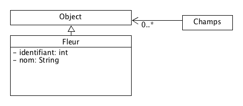

# Découvrir Java

## Introduction
Dans cette première partie, nous allons découvrir Java sous la forme de petits programmes. Nous n'allons pas tout de suite chercher à faire de programmes complexes, mais nous allons utiliser des mécanismes de la Programmation Orienté Objet et observer leurs effets

L'idée va être de se familiariser avec différents concepts: classes, instances, interfaces, héritage et surtout modèles de conception.


## Environnement de développement
### Installation d'Eclipse
Nous allons installer Eclipse comme environnement de développement de base.

## Premiers programmes
### Hello World avec Java
Notre premier programme va être un Hello World. On le crée dans un fichier nommé HelloWorld.java et situé dans un répertoire fr/viacesi/pau/ap2017.

```java
/*
 * Entete
 */

package fr.viacesi.pau.ap2017 ;

/**
 * Ceci est une classe
 */
public class HelloWorld {

    /**
     * @param args les arguments de la ligne de commande
     */
    public static void main(String[] args) {
        System.out.println("Hello World!"); // Affiche
    }

}
```

### Les chaînes de caractères
Les chaînes de caractères en Java sont gérées par la classe String.

Ouvrez la documentation JAVA 8 qui se trouve ici : [https://docs.oracle.com/javase/8/docs/api/index.html?overview-summary.html](https://docs.oracle.com/javase/8/docs/api/index.html?overview-summary.html)

Essayez de trouver la classe String dans cette documentation.

Faites un diagramme UML représentant cette classe (avec au moins sa classe parente si elle en a une).

### Les objets

Toute classe Java hérite toujours de la classe Object. Cette classe contient deux méthodes intéressantes: `getClass()` et `toString()`


Nous allons partir de notre programme Hello World pour lui ajouter quelques fonctionnalités.

Pour cela, nous allons dupliquer cette classe en renommant le fichier en l'appelant LaClasse (toujours dans le même répertoire)

Une fois cela fait, essayez de compiler et de lancer le programme. Que constatez-vous ?


Vous allez modifier le `main(String[])` en remplaçant le `system.out.println` comme suit:


```java
public static void main(String[] args) {
    Object instance = new LaClasse();
    System.out.println(instance); // Affiche
}
```

Lancez le programme. Que constatez-vous ?

Maintenant, vous allez modifier la classe en ajoutant une méthode nommée `toString()` :

```java
  public String toString(){
    return "Je suis LaClasse:"+super.toString();
  }
```

Relancez le programme. Que constatez-vous ?


À nouveau, vous allez modifier la classe en modifiant la  méthode `toString()` :

```java
  public String toString(){
    return "Je suis LaClasse (" + getClass() +"  ):"+ super.toString();
  }
```

Relancez le programme. Que constatez-vous ?

## Représentation d'une Personne

Nous allons définir une classe personne comme suit:
```java
public class Personne {
	String nom;
	String prenom;
	String dateNaissance;
	String adresseMail;
	String telephone;

	public static void main(String[] args) {
		Personne utilisateur = new Personne();

		utilisateur.nom           = "McEnroe";
		utilisateur.prenom        = "John";
		utilisateur.dateNaissance = "10/10/1960";
		utilisateur.adresseMail   = "johnmcenroe@usa.tennis.com";
		utilisateur.telephone     = "+001 203 204 205";

		System.out.println(utilisateur.nom);
		System.out.println(utilisateur.prenom);
		System.out.println(utilisateur);
	}
}

```
Exécutez ce programme. Que constatez-vous ?

Les attributs de cette classe sont:
* nom          
* prenom       
* dateNaissance
* adresseMail  
* telephone    

Aux attributs de cette classe, on va pouvoir rajouter des méthodes:

```java
public class Personne {
	String nom;
	String prenom;
	String dateNaissance;
	String adresseMail;
	String telephone;

	public static void main(String[] args) {
		Personne utilisateur = new Personne();

		utilisateur.nom           = "McEnroe";
		utilisateur.prenom        = "John";
		utilisateur.dateNaissance = "10/10/1960";
		utilisateur.adresseMail   = "johnmcenroe@usa.tennis.com";
		utilisateur.telephone     = "+001 203 204 205";

		System.out.println(utilisateur.nom);
		System.out.println(utilisateur.prenom);
		System.out.println(utilisateur);
	}
  public String getNomPrenom(){
    return nom+" "+prenom;
  }

  public String getPrenomNom(){
    return prenom+" "+nom;
  }
}

```

Ces méthodes sont des méthodes d'instance: elles sont liées à un exemplaire de la classe Personne. On peut les utiliser en ajoutant à la fin de la méthode `main(String[])` les lignes suivantes:

```java
System.out.println(utilisateur.getNomPrenom());
System.out.println(utilisateur.getPrenomNom());

```
Que constatez-vous ?


Nous allons maintenant modifier l'affichage obtenu avec la ligne suivante du `main(String[])`:

```java
System.out.println(utilisateur); // Dépend de la méthode toString()

```

Pour cela, nous surchargeons la méthode toString qui était déjà définie dans la classe Object:

```java
public String toString(){
  return nom+" "+prenom+" "+dateNaissance+" "
      +adresseMail+" "+telephone;
}

```

Que constatez-vous ?


## Autre exemple d'héritage
Nous venons d'utiliser une des propriétés de l'héritage. En voici un autre exemple.

### Heritage

Vous allez créer trois classes selon le diagramme de classe suivant:


La méthode `ecrire(String chaine)` de stylo produira l'écriture sur la sortie standard.

La méthode `ecrire(String chaine)` de ses classes filles rajoutera `ECRIRE_EN_couleur{` au début de la chaîne avant de l'écrire puis y rajoutera `}` à la fin de la chaîne.

Par exemple si on a dans la fonction `main(String[])`:

```java
StyloRouge styloR = new StyloRouge();
styloR.ecrire("Bonjour");
// affiche: "ECRIRE_EN_ROUGE{Bonjour}"

```

Petite difficulté supplémentaire: vous n'avez pas le droit d'utiliser de `System.out.println` dans les classes `StyloRouge` ni `StyloBleu`

### Utilisation par un autre objet


Nous allons maintenant faire en sorte que notre stylo soit utilisé par un poète qui souhaite rédiger un poème. Il va simplement l'afficher à l'écran grâce au stylo.

Voici un diagramme de classe représentant notre programme:


Et voici le programme correspondant:

```java
public class Poete {
	private String monNouveauPoeme = "";
	private Stylo stylo ;

	public void ajouterVersAuPoeme(String vers){
		monNouveauPoeme = monNouveauPoeme + "\n" ;
		monNouveauPoeme += vers;
	}

	public void setStylo(Stylo stylo){
		this.stylo = stylo;
	}

	public void ecrirePoeme(){
		stylo.ecrire(monNouveauPoeme);
	}
}
```

La classe `main(String[])` ressemble à ceci:

```java
public class Main {
	public static void main(String[] args) {
		Poete poete = new Poete();
		poete.ajouterVersAuPoeme("Maître Corbeau, sur un arbre perché");
		poete.ajouterVersAuPoeme("Tenait en son bec un fromage");

		poete.setStylo(new StyloRouge());

		poete.ecrirePoeme();
	}
}
```

Modifiez ce code en supprimant la ligne suivante du `main(String[])`:

`poete.setStylo(new StyloRouge());`

Que constate-t-on ?

Cette erreur vient du fait que la variable monStylo n'est plus initialisée. Comment lui donner une valeur par défaut, de sorte que même si on n'appelle pas la méthode `setStylo(Stylo)` le programme ne plante pas ?


## Manipulation de chaînes de caractères

Dans la classe Poete, nous avons utilisé des chaînes de caractères avec l'opérateur "+".

Nous allons étudier ici les propriétés de la classe String

### Quelques expériences étonnantes

Exécuter le programme suivant:

```java

public class ExerciceChaine {
	public static void main(String[] args) {
		String uneChaine = "Bonjour" ;
		String autreChaine = "Bonjour" ;

		ExerciceChaine ec = new ExerciceChaine();
		System.out.println("-- Deux chaines identiques");
		ec.testChaines(uneChaine, autreChaine);

		System.out.println("-- Une nouvelle instance");
		autreChaine = new String("Bonjour");
		ec.testChaines(uneChaine, autreChaine);

		System.out.println("-- Une concaténation simple");
		autreChaine = "Bon" + "jour" ;
		ec.testChaines(uneChaine, autreChaine);

		System.out.println("-- Une concaténation avec des variables différentes");
		autreChaine = "Bon" ;
		String troisiemeChaine = "jour";
		autreChaine = autreChaine + troisiemeChaine;
		ec.testChaines(uneChaine, autreChaine);
	}
	public void testChaines(String a, String b){
		if(a == b){
			System.out.println("Les chaînes '"+ a + "' et '"+b+ "' sont les mêmes");
		}
		else{
			System.out.println("Les chaînes '"+ a + "' et '"+b+ "' sont différentes");
		}
	}
}

```

Remplacez la méthode `testChaines(String, String)` par la suivante:

```java
public void testChaines(String a, String b){
  if(a.equals(b)){
    System.out.println("Les chaînes '"+ a + "' et '"+b+ "' sont les mêmes");
  }
  else{
    System.out.println("Les chaînes '"+ a + "' et '"+b+ "' sont différentes");
  }
}
```
Que constatez-vous ?

Allez voir dans la Javadoc à quoi correspond la méthode `equals(Object)`.

Pourquoi est-elle utile ?

### Quelques méthodes pour utiliser les String
Exécutez le programme suivant:

```java
public static void main(String[] args) {
  String chaine = "Quelques caractères";

  System.out.println(chaine.length());
  System.out.println(chaine.substring(2));
  System.out.println(chaine.substring(5,10));
  System.out.println(chaine.startsWith("Que"));
  System.out.println(chaine.startsWith("que"));
  System.out.println(chaine.endsWith("res"));
  System.out.println(chaine.endsWith("re"));
  System.out.println(chaine.indexOf("ra"));
  System.out.println(chaine.toLowerCase());
  System.out.println(chaine.toUpperCase());
}

```
Aidez-vous de la Javadoc pour comprendre ce que font chacune de ces méthodes.

En utilisant la chaîne "  Je suis une chaîne moi aussi   " (attention aux espaces en début et fin de chaîne), testez les effets des méthodes suivantes:

* `lastIndexOf(String)`
* `trim()`
* `toString()`

Que constatez-vous ? Est-ce logique ?


### Lecture de valeurs depuis la console

Le code suivant permet de récupérer des valeurs depuis les entrées clavier:

```java
Scanner in = new Scanner(System.in);

String s = in.next();
int i = in.nextInt();
```

Le programme suivant fait une démonstration de cela:

```java

import java.util.Scanner;

public class LectureValeur {
	private Scanner scanner = new Scanner(System.in);

	public static void main(String[] args) {
		LectureValeur lectureValeur = new LectureValeur();

		String valeur = lectureValeur.demanderChaine("Veuillez entrer une chaîne:");
		System.out.println("La valeur entrée est: "+valeur);
	}

	public String demanderChaine(String message){
		System.out.println(message);
		return scanner.next();
	}
}

```


#### Information à propos de la méthode System.console()

Le code suivant permet de récupérer des valeurs mais ne marchera pas sous Eclipse (ou dans un IDE):
```java
String reponse = System.console().readLine();
System.out.println(reponse);
```


### Parcours d'une chaîne et boucles

Nous allons utiliser une boucle simple pour récupérer chaque caractère d'une chaîne.

```java
for (int i = 0 ; i < chaine.length(); i++) {
  System.out.println(chaine.charAt(i));
}
```

Analysez le code ci-dessus et posez des questions si vous ne le comprenez-pas.

Ecrivez un programme qui détermine si une chaîne entrée au clavier est un palindrome (un mot qui se lit dans les deux sens).


## Modifier le comportement d'une classe
Il est possible de changer le comportement d'une classe en se passant de l'héritage.

Ce n'est en effet pas toujours la meilleure solution puisqu'il existe de nombreuses possibilités pour modifier le comportement d'une classe

### Exercice
Réfléchissez à un moyen de vous passer des classes StyloRouge et StyloBleu tout en gardant les fonctionnalités qu'ils offrent.

Vous allez utiliser pour cela des attributs et modifier le comportement de la méthode `ecrire(String)`.

Dessinez le diagramme de classe correspondant.


## Créer des objets

La création d'objet en Java se fait avec le mot clef `new`.

L'opération effectuée avec `new` est appelée une instantiation: on crée une instance (c'est-à-dire un "exemplaire") d'une classe.

Cette instance est un exemplaire indépendant des autres objets de cette classe. Il se comporte cependant avec les mêmes règles.

### Création d'une nouvelle classe

Vous allez implémenter une classe nommée `Fleur` dans le paquet `fr.viacesi.pau.ap2017.nature`

Cette classe se fera sur le modèle suivant:


Implémentez cette classe de sorte que `toString()` renvoie une valeur ressemblant à `nomDeLaFleur(3)` (avec `nom = "nomDeLaFleur"` et `identifiant = 3`

Essayez d'instancier cette classe à partir de la méthode `main(String[])` de `LaClasse` et d'afficher cette instance avec un `System.out.println(String)`.

Que constatez-vous ?

Est-on limité par quelque chose ici ?

#### Constructeur

Pour pouvoir créer cette classe, il existe un constructeur par défaut. Sauf qu'il ne permet pas de modifier les valeurs des attributs.

Créer un nouveau constructeur sur le modèle suivant:

```java
public Fleur(String nom, int identifiant){
  this.nom = nom;
  this.identifiant = identifiant;

}
```

Essayez d'utiliser ce constructeur et d'afficher l'instance depuis la méthode `main(String[])`

Créez ainsi plusieurs instances de fleur et affichez-les.


### Création d'une classe Champs
La classe Champ sera codée de la manière suivante:

```java
package fr.viacesi.pau.ap2017.nature;
import java.util.List;
import java.util.ArrayList;

public class Champs {
	private List mesObjets = new ArrayList();

	public void addObjet(Object o){
		mesObjets.add(o);
	}

	public String toString(){
		String valeur = "Champs[";
		for (Object o : mesObjets) {
			valeur += o.toString() + ", ";
		}
		return valeur +"]" ;
	}
}
```


### Utilisation

Dans votre `main(String[])`, rajoutez les lignes suivantes:

```java
Champs monChamp = new Champs();

monChamp.add(new Fleur("Paquerette", 1));
monChamp.add(new Fleur("Paquerette", 2));

monChamp.add(new Fleur("Violette", 3));
monChamp.add(new Fleur("Bouton d'or", 4));

System.out.println(monChamp);

```
Dessinez le diagramme de classe représentant la classe Champs.


Que s'est-il passé ?


#### Un peu d'UML

Si on dessine le diagramme des classes participantes à ce programme, on devrait voir apparaître des cardinalités:



Le `0..*` signifie qu'un objet de type Champs peut se voir associé 0 ou N éléments de type Object

On peut associer les cardinalités suivantes:

* `0`
* `0..*`
* `1`
* `1..*`
* `*`

D'après vous que signifient-elles ?

Quelle différence pouvez-vous noter par rapport à Merise ?

#### Fabrique


Précédemment, nous avons utilisé le mot clé `new` pour créer des objets `Fleur`. Cependant, il est possible de masquer l'utilisation de `new` en "délégant" la responsabilité de la création à une autre classe.

Pour cela, vous allez modifier la classe `Fleur` et remplacer `protected` par `public` au niveau de son constructeur.

```java
protected Fleur(String nom, int identifiant){...}
```

Le code que nous avions écrit précédemment ne fonctionne plus. Nous allons maintenant créer la classe suivante:


```java
package fr.viacesi.pau.ap2017.nature;

public class FabriqueFleur {
	private int identifiant = 0;
	private String nom ;

	public FabriqueFleur(String nom){
		this.nom = nom;
	}

	public Fleur creerFleur(){
		return new Fleur(nom, identifiant++);
	}
}
```


Et l'utiliser dans notre `main(String[])` de la manière suivante:

```java
FabriqueFleur fabPaquerette = new FabriqueFleur("Paquerette");
Fleur f = fabPaquerette.creerFleur();
```

Créez plusieurs instances de `Fleur` et testez votre code.


##### Pour conclure sur la fabrique

Nous venons de voir que nous pouvions encapsuler la création d'objets à l'intérieur d'autres objets. Ce principe sera réutilisé et amélioré lorsque nous étudierons les Design Patterns.
