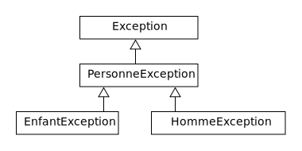

Introduction
============

Le mécanise de gestion des exceptions en Java permet de traiter des
situations exceptionnelles: il permet de s’affranchir de structures de
contrôles qui alourdiraient le code.

Ce mécanisme doit être utilisé en suivant certaines règles qui
permettent d’adapter le comportement du programme au type de situation
rencontrée.

Le coup de la panne
-------------------

Dans une voiture, le bon fonctionnement du moteur dépend d’autres
organes. Par exemple, le moteur ayant besoin de carburant, celui-ci est
acheminé jusqu’au système d’injection par la pompe à carburant. Cette
même pompe puise dans le réservoir de carburant.

`Réservoir ==> Pompe à carburant ==> Injection ==> Moteur`

Le moteur ne peut plus fonctionner lorsque le réservoir est vide. Cette
situation étant exceptionnelle, l’absence de carburant entraînerait,
dans un programme Java, la levée d’une exception.

` \nearrow EXCEPTION ! `

`Réservoir ==> Pompe à carburant ==> Injection ==> Moteur`

Un programme bien écrit va permettre de transmettre l’exception au
moteur et donc de l’arrêter proprement.

Arrêter proprement un programme revient à éviter qu’il ne se retrouve
dans un état instable.

Une fois dans un état instable, un programme ne sera plus capable de
fonctionner correctement. Il aura un comportement imprévisible, voire
dangereux.

Si on représentait le fonctionnement du moteur avec un programme Java,
on pourrait écrire ceci:

```java
    class Moteur {
        private SystemeInjection systemeInjection ;

        ...

        public void tourne(){
            systemeInjection.injecteCarburant(quantiteNecessaire, this.cylindre1 , this.cylindre2, this.cylindre3, this.cylindre4);
            ...
        }   
    }
    class SystemeInjection {
        private PompeACarburant pompeACarburant ;

        ...

        public void injecteCarburant(int quantite, Cylindre c1, Cylindre c2, Cylindre c3, Cylindre c4){
            pompeACarburant.getCarburant(quantite);
            ...
        }
    }
    class PompeACarburant{
        private Reservoir reservoir;
        ...
        public void getCarburant(int quantite){
            int quantitePrelevee = reservoir.fournirCarburant(quantiteCarburant); // Que se passe-t-il si la quantité de carburant est supérieur à ce qui reste dans le réservoir ?
        }
    }
    class Reservoir{
        private int quantiteCarburant; //la quantité de carburant dans le réservoir.
        public int fournirCarburant(int quantite){
            // On ne peut pas avoir une quantite de carburant négative dans le réservoir, comment signaler cela à l'appelant (la pompe à carburant)
        }
    }
```

Lorsque le réservoir est vide, on doit se poser la question de savoir
qui est responsable de traiter cette situation exceptionnelle:

-   le réservoir ?

-   la pompe à carburant ?

-   la pompe à injection ?

-   le moteur ?

Autrement dit, quel comportement adopter et à quel moment dans le
déroulement du programme ?

La pile d’appel, l’appelant et l’appelé
---------------------------------------

En anglais, the stack, the caller and the callee .

Pour savoir si une exception doit être levée (`throw`) ou attrappée
(`catch`), il faut se poser la question suivante: a-t-on les moyens de
traiter correctement la situation exceptionnelle à ce niveau du
programme ?

Si ce n’est pas le cas, l’exception sera passée à l’appelant, via une
clause `throw`.

Si c’est le cas, on va pouvoir la traiter via une clause `try`/`catch`
(éventuellement `finally`)

Qui arrête le moteur ?
----------------------

Dans notre exemple, il est intéressant de se poser la question:
qu’est-ce qui fait que le moteur s’arrête ?

C’est bien l’absence de carburant dans les cylindres qui provoque
l’arrêt du moteur. Cependant, on va lever une exception lorsque la pompe
à carburant tentera de prélever trop de carburant depuis le réservoir.

Pour cela, la méthode fournirCarburant lèvera une exception si la
quantité demandée est trop importante:

class Reservoir

private int quantiteCarburant; //la quantité de carburant dans le
réservoir. public int fournirCarburant(int quantite) throws
PasAssezDeCarburantException

Mettre de l’huile, c’est important
----------------------------------

Toujours dans l’analogie avec le moteur, occupons-nous d’une partie
vitale pour celui-ci:

**le circuit d’huile**

Autant le moteur peut se passer de carburant sans trop de dommage,
autant le faire tourner sans huile conduit à sa destruction certaine.

Comment géreriez-vous cela en utilisant les exceptions ?

Les objets de type *Throwable*
==============================


La classe Error
---------------
```java
    public class ErreurMemoire {
        public static void main(String[] args) {
            double[] tableauTropGrandPourLaMemoire = new double[1000000000];
        }
    }
```

On pourrait aisément traiter cette erreur de cette manière:

```java
    public class ErreurMemoirePasse {

        public static void main(String[] args) {
            try {
                double[] tableauTropGrandPourLaMemoire = new double[1000000000];
            } catch (Error e) {
                System.out.println("On continue malgré l'erreur mémoire");
            }
            System.out.println("On sort (que peut-on faire d'autre sans mémoire ?)");
        }
    }
```

Quels sont les avantages et inconvénients de ce code ?

La classe Exception
-------------------

La classe Exception est la super-classe de toutes les exceptions levées
lorsqu’une erreur survient dans une application Java. Elle est propagée
jusqu’à être prise en charge, soit par un bloc `catch`, soit en étant
affichée par la sortie d’erreur (`System.err`) ou la sortie standard.


```java
    public class LeveeExceptionMain {    
        public static void main(String[] args) {
            int[] tableau = new int[10];
            int valeur = tableau[10];
            System.out.println("Fin de l'exécution");   
        }
    }
```

### Traitement d’une exception

La manière classique de traiter une exception est de l’attraper en
définissant un bloc `try-catch`.

```java
    public class LeveeExceptionTraitee {
        public static void main(String[] args) {
            int[] tableau = new int[10];
            try {
                int valeur = tableau[10];
                System.out.println("valeur="+valeur);
            } catch (ArrayIndexOutOfBoundsException e) {
                System.out.println("Traitement de l'exception");
            }
            System.out.println("Fin de l'exécution");   
        }
    }
```

Une erreur de compilation courante:

```java
    public class LeveeExceptionTraitee {
        public static void main(String[] args) {
            int[] tableau = new int[10];
            try {
                int valeur = tableau[10];
                System.out.println("valeur="+valeur);
            } catch (Exception e) {
                System.out.println("Traitement de l'exception");
            } catch (ArrayIndexOutOfBoundsException e) {
                System.out.println("ArrayIndexOutOfBoundsException attrapée");
            }
            System.out.println("Fin de l'exécution");   
        }
    }
```

Réécrire le code correct pour ce cas.

Clause `finally`
----------------

Un bloc `finally` situé après un bloc `try` sera toujours exécuté, même
si des exceptions sont levées pendant l’exécution du bloc `try`. Par
exemple:

```java
    public class ExempleFinally {
        public static void main(String[] args) {
            int[] tableau = new int[10];
            try {
                int valeur = tableau[10];
                System.out.println("valeur="+valeur);
            } finally {
                System.out.println("On exécute toujours cette portion de code");
            }
            System.out.println("Fin de l'exécution");   
        }
    }
```

Créer ses propres exceptions
----------------------------

On peut générer ses propres exceptions:

```java
    package fr.viacesi.ap2017.humain;

    public class TailleInvalideException extends Exception {
        public TailleInvalideException() {
            super();
        }
        public TailleInvalideException(String message, Throwable cause) {
            super(message, cause);
        }
        public TailleInvalideException(String message) {
            super(message);
        }
        public TailleInvalideException(Throwable cause) {
            super(cause);
        }
    }
```

Que l’on va utiliser dans notre code:

```java
package fr.viacesi.ap2017.humain;

    public class Humain {
        private int taille;

        public int getTaille() {
            return taille;
        }

        public void setTaille(int taille) throws TailleInvalideException {
            if(taille < 0 || taille > 300) {
                throw new TailleInvalideException("taille "+taille+" n'est pas valide.");
            }
            this.taille = taille;
        }

        private String nom, prenom;

        public Humain(String nom, String prenom){
            this.nom = nom;
            this.prenom = prenom;
        }


        @Override
        public String toString() {
            return super.toString()+ "/"+nom+" "+prenom;
        }

    }
```

Ecrivez le programme permettant de gérer cette exception.

RuntimeException
----------------

On définit une classe NePeutPasAvoirEnfantException qui hérite de
RuntimeException. On l’utilise ici:

```java
        public void ajouteEnfant(Humain enfant){
            if (age<15) {
                throw new NePeutPasAvoirEnfantException("Je suis trop jeune !");
            }
        }
```

Qu’observez-vous ?

Bonnes pratiques
================

Limiter la définition de nouvelles classes d’exception
------------------------------------------------------

Les nouvelles classes d’exception ne sont à créer que si réellement
nécessaire. Toujours se poser la question de savoir si une exception
standard ou existante ne pourrait pas être utilisée.

Ne jamais ignorer une exception
-------------------------------

```java
    public class NeJamaisFaireCeci {
        public static void main(String[] args) {
            try{
                int valeur = tableau[10];
                System.out.println("valeur="+valeur);
            }catch(Exception ex){}
        }
    }
```

Sur un code finalisé, tout bloc `catch` doit contenir un traitement
adapté de l’exception. `ex.printStackTrace()` n’est pas suffisant.

Sur un programme en cours de développement, on tolère que le bloc
`catch` ne contienne que :

-   un appel à `ex.printStackTrace()`

-   un message indiquant que ce code doit être complété (ex:
    `/* TODO: traiter l’exception */`).

Pas de `return` dans `finally`
------------------------------

Exécuter le code suivant:

```java
    public class ReturnDansFinally {

        public String methodeFinally(){
            try{
                return "Je devrais sortir";
            }finally{
                return "Pourtant c'est moi qui sort !";
            }
        }

        public String methodeException(){
            try{
                return "Je sors";
            }catch(Exception e){
                return "Je ne sortirai pas";
            }
        }

        public static void main(String[] args) {
            ReturnDansFinally rdf = new ReturnDansFinally();
            System.out.println("methodeFinally dit   : "+rdf.methodeFinally());
            System.out.println("methodeException dit : "+rdf.methodeException());
        }
    }
```

Qu’observez-vous en exécutant ce code ?

Qu’en déduisez-vous par rapport à la meilleure manière de coder avec
`finally` ?

Ne faites pas de contrôle de flux avec des exceptions
-----------------------------------------------------

Le type de sortie d’une boucle tel qu’utilisé ici est à proscrire:

```java
    for (int i = 0; i < args.length; i++) {
        if(args[i] = null){
            throw new RuntimeException("Fin de boucle");
        }

        int valeur = args[i] + valeur;
    }
```

Que pouvez-vous utiliser à la place ?

Gestion des erreurs sur les entrées/sorties
-------------------------------------------

Un exemple de bonne gestion des erreurs lors des accès à un fichier.

```java
    import java.io.BufferedReader;
    import java.io.FileNotFoundException;
    import java.io.IOException;
    import java.io.FileReader;

    /**
     * Classe de lecture de fichier gérant les erreurs d'entrée/sortie
     */
    public class LectureFichierAvecException {

        public void lecture(){
            BufferedReader br = null;
            try {
                br = new BufferedReader(new FileReader("unfichier.txt"));
                String ligne;
                while((ligne=br.readLine())!=null){
                    System.out.println(ligne);      
                }

            } catch (FileNotFoundException ex) {
                System.out.println("Se plaindre à l'utilisateur");
                System.out.println("Le fichier n'existe pas !!!");
            } catch (IOException ex) {
                System.out.println("Informer l'utilisateur");
                System.out.println("Il y a eu une erreur");
            } finally {
                if (br != null) {
                    try {
                        br.close();
                    } catch (IOException ex) {
                        System.out.println("Cela ne devrait pas arriver, mais on le signale quand même.");
                    }
                    System.exit(1); //Un code d'erreur signale l'erreur
                }
            }
        }
        public static void main(String[] args) {
            new LectureFichierAvecException().lecture();
        }
    }
```

Encapsulez les exception
------------------------

Exécutez le code suivant:

```java
    public class UnTestAvecUneExceptionGenereeParUneAutre {

        public static void main(String[] args) throws Exception {
            try{

                throw new Exception("Je vais me cacher");

            }catch(Exception ex){

                throw new Exception("Je me montre");
            }
        }
    }
```

Q’observez-vous ?

Utilisez plutôt, dans le bloc `catch` :
`throw new Exception(Je me montre, ex);`

La clause `throws` doit toujours lister toutes les exceptions possibles
-----------------------------------------------------------------------

Soit les classes d’exception telles que:



Ne pas écrire simplement:

```java
    public void grandir() throws PersonneException{
        //Un traitement ici
    }
```

Mais déclarer toutes les exceptions :

```java
    public void grandir() throws PersonneException,
                                 GarconException,
                                 HommeException {
        //Un traitement ici
    }
```

Traiter les cas de levée de manière groupée
-------------------------------------------

Considérons le code suivant:

```java
    Class classe = null;
    Object objet = null;

    try {
        type = Class.forName("unknown.package.Classe");
            // throws ClassNotFoundException
    } catch (ClassNotFoundException e) {
        e.printStackTrace();
        //Traiter ClassNotFoundException
    }

    try {
        object = type.newInstance();
            // throws InstantiationException, IllegalAccessException

    } catch (InstantiationException e) {
        e.printStackTrace();
        //Traiter InstantiationException
    } catch (IllegalAccessException e) {
        e.printStackTrace();
        //Traiter IllegalAccessException
    }

    String string = object.toString();
```

Que se passe-t-il si l’on exécute ce code ?
