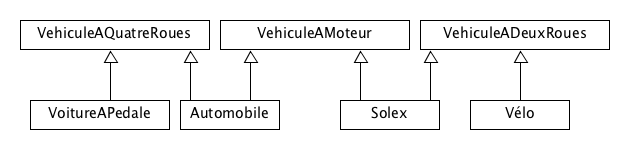
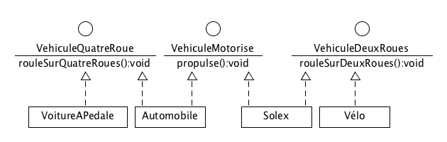
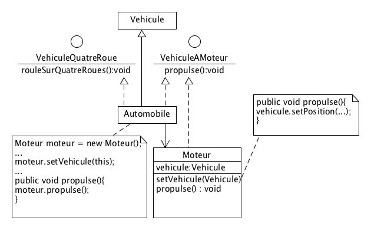
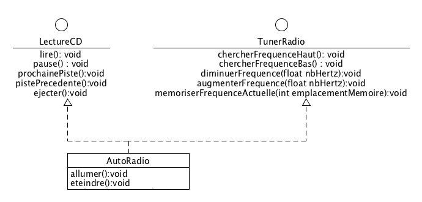

# Travailler avec les objets


## Interfaces

Les interfaces permettent de réaliser un "héritage multiple". C'est-à-dire, pour une classe d'avoir plusieurs classes parentes.

En effet, en Java, l'héritage multiple n'est pas possible. Vous ne trouverez jamais ce genre de chose:



Et c'est tant mieux !

Il existe bien d'autres moyens de partager des fonctionnalités entre des classes différentes.

Les interfaces en Java permettent de définir une liste de fonctionnalités que fournira une classe.

Ce sont des classes *totalement abstraites*



En Java, une classe *implémente* une interface mais n'en hérite pas.

Donc, l'inconvénient est qu'il faut réimplémenter la méthode de l'interface dans la classe.

Heureusement, on peut (par exemple) utiliser ce type de conception afin de réutiliser le code de la classe `Moteur`:




### L'interface entre deux domaines

Si on prend l'exemple d'un ordinateur, on pourra le brancher au secteur électrique quel que soit le pays où l'on se trouve. L'interface entre l'ordinateur et le réseau est multiple et se fait grâce à un adaptateur secteur.

Ce même adaptateur possède plusieurs interfaces interchangeables permettant de le brancher à une prise électrique. Et cette prise de courant est une interface vers l'alimentation électrique présente dans le bâtiment.

L'interface ici est le câble. C'est le lien entre l'appareil électrique et le réseau électrique.


### Utilisation des interfaces en Java

#### Déclaration
```java
public interface VehiculeAMoteur {
  public void propulse();
}

```

#### Implémentation
```java
class Automobile implements VehiculeAMoteur, VehiculeAQuatreRoues{
  //...
}

```


Voir le cours [https://en.wikibooks.org/wiki/Java_Programming/Interfaces](https://en.wikibooks.org/wiki/Java_Programming/Interfaces)


### Application
Prenons un autre exemple concret: un autoradio.

Un autoradio  :
* permet d'écouter la radio: il fournira une interface (des boutons) permettant de régler la station d'écoute et de mémoriser certaines fréquences
* fournit des commandes de base:
* * régler le volume
* * allumer/éteindre
* écouter un CD:
* * il fournit un lecteur (une interface d'accès entre les données stockées sur un CD et l'appareil)
* * des boutons permettant de naviguer et commander la lecture/pause/éjection du CD
* lire une clef USB contenant des MP3

Chaque item principal ci-dessus peut être représenté sous la forme d'une interface.





Ce qui est important ici est qu'une classe donnée puisse être vue comme pouvant avoir plusieurs fonctionnalités regroupées par thème (une interface <=> un thème).

#### Ecriture du code

Ecrivez le code des interfaces permettant de réaliser les fonctions *Tuner* et *Lecteur CD*

Chaque méthode, au moment de son appel fera un affichage dans la console.

```
Bouton morceau suivant appuyé
Bouton volume modifié: niveau 4
```

Un menu permettra de choisir la fonction à activer:

```
1. Augmenter volume
2. Diminuer volume
3. Passer au mode Tuner
4. Passer au mode CD


1. Morceau CD suivant
2. Morceau CD précédent

```

Réaliser le diagramme d'activité correspondant.

#### Lecteur MP3

Modélisez et codez l'interface de lecture des MP3.

#### Format des fichiers Audio

Les formats de fichiers audio possible sur une clef USB sont:
* MP3
* OggVorbis
* WMA
* AAC

Faites une modélisation UML puis codez la prise en compte de ces formats.


Prochain chapitre: [Exceptions.md](Exceptions.md)
